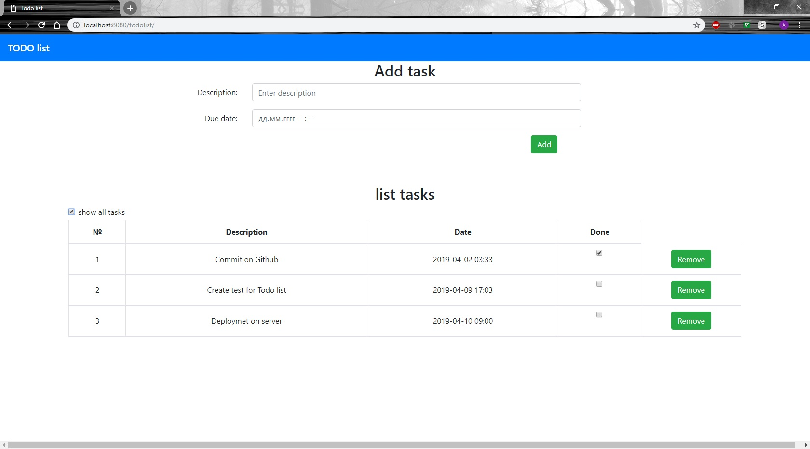

# TODO list 

## Задание: необходимо создать простое приложение TODO list.
1. Одна таблица в базе данных.
1. Веб приложение должно иметь одну страницу index.html. 
1. На странице форма: добавить новое задание, описание.
1. Ниже список всех заданий и галочка: выполнено / не выполнено.
1. Вверху списка галочка: "показать все". Если включена, то показывать все задания. Если нет - только невыполненные.
1. Все данные на форму загружаются через AJAX.
1. Данные должны сохраняться через Hibernate.

## Применямые технологии
Tomcat Servlet Container, Hibernate, PostgreSQL, Jackson, JUnit, Mockito, HTML, Bootstrap, jQuery .

## Изображения работы
Добавление нового задания 
    
    
Отоброжаение не выполненых заданий 
    
    
Отоброжаение всех заданий 
    
    
Удаление задачи и обновление статуса задачи 
    
